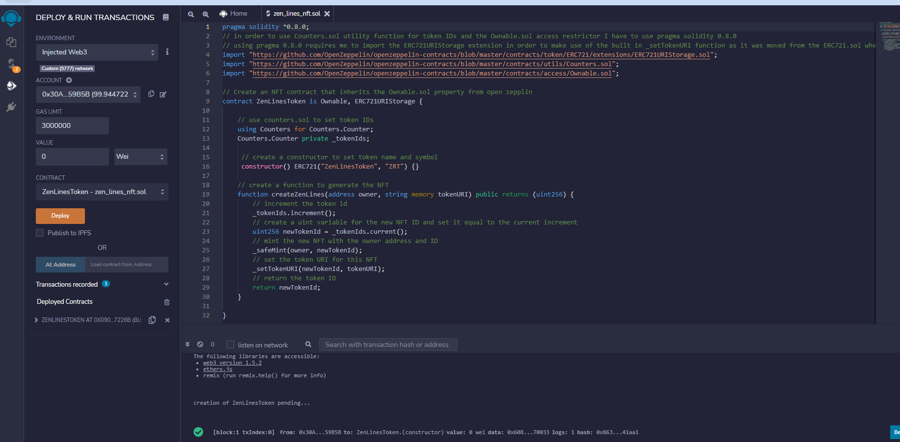
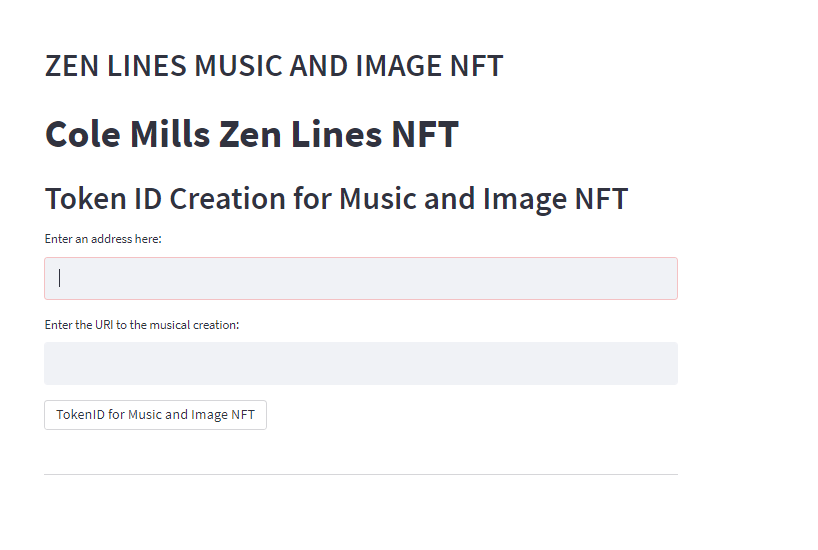
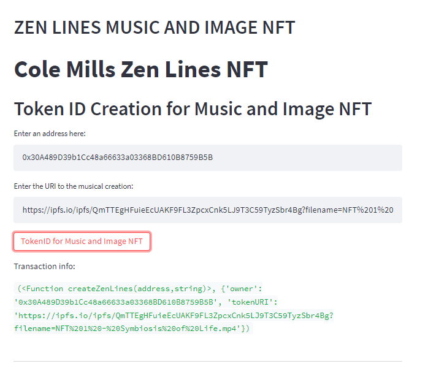
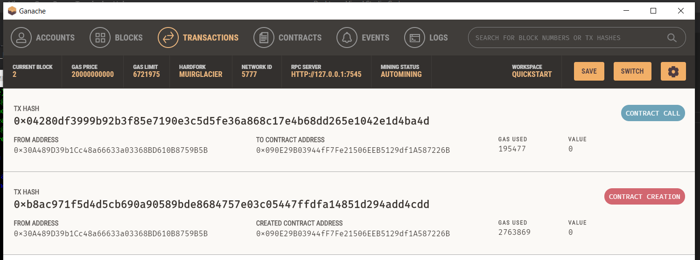
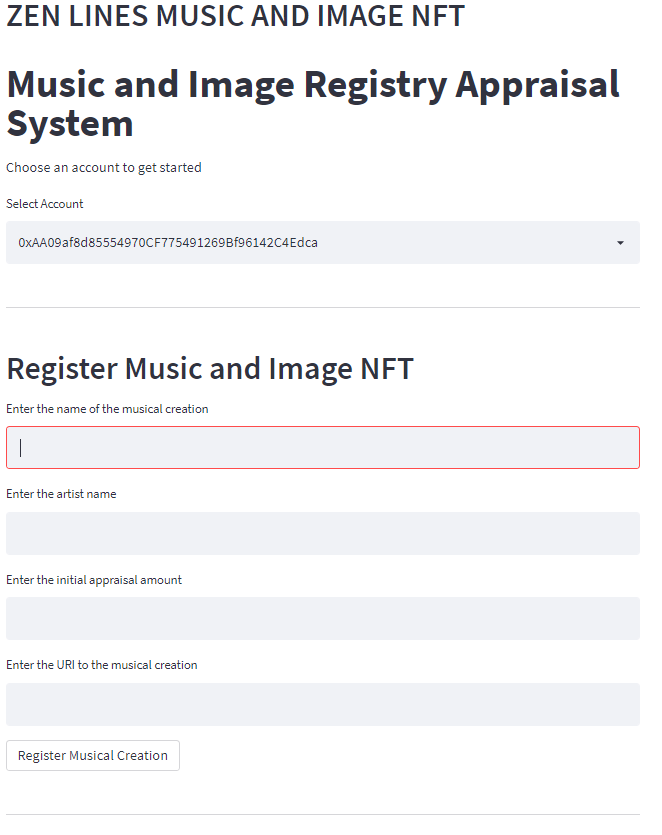
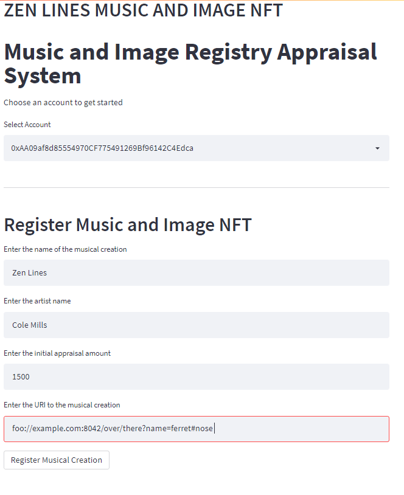
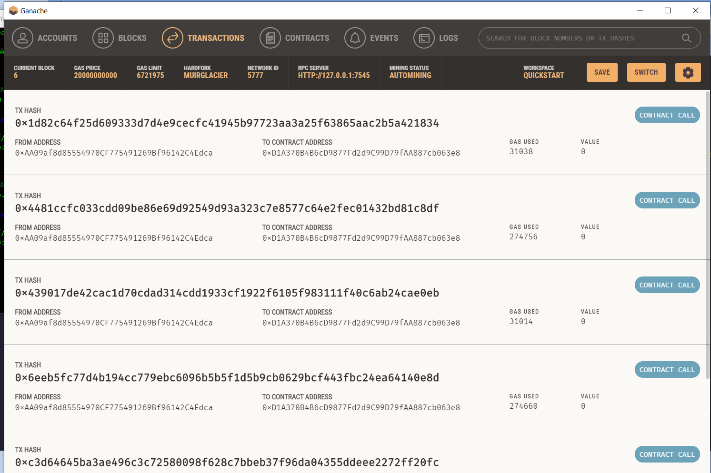

# Zen Line NFTs App
## Music and Image NFT
### NFT Solidity Contract By Zack Schmidt
### Gallery Solidity Contract, Music and Drawing By Cole Mills
### Auction Contract by Kailen Nelson
### Streamlit App integration by Franklin Vaca 
#

## **App creation:**

Two apps were created for this project:

- nft_app.py  - This app creates the TokenID of the music and image creation.

- app.py  - This app allows to register our musical piece and image to be stored in a Gallery. It also has the functionality to record and modify appraisals for the musc and image piece.

____________

# **Music and Image NFT**
## **TokenID creation app - nft_app.py:**

**Zen Lines NFT contract:**

The nft_app solidity contract was created by Zack and deployed using Ganache test network.

*Zen Lines Token contract reviewed and succesfully compiled* 

 

*Zen Lines Token contract deployment gas fees*

 

*App created using Streamlit* 

 

*TokenID created and receipt of the transaction sent to the blockchain.* 

 

*Gas fees incurred due to the TokenId creation.*

 

## **Gallery registration and appraisal app - app.py:**

**Gallery contract:**

The contract was created using Solidity, compiled and deployed using REMIX IDE, Metamask and Ganache.

*Gallery contract reviewed and succesfully compiled* 

 

*Gas Fees spent due to Contract Creation - Screenshot from Ganache transactions tab*

 

The App was created using streamlit and executed using GitBash

 

*Music registration in the Gallery*

 

*New Appraisal functionality of the App with receipt Hash information*

 

*Appraisal Report functionality of the App with blockchain hash information*

 

*Ganache transactions report indicating the gas fees associated to the execution of the different functionalities of the App.*

 

The contract were compiled and deployed without any issues as indicated in the screenshots. The gas fees from the transactions report from Ganache indicate that the App succesfully executed the contracts and added that information to the blockchain.

