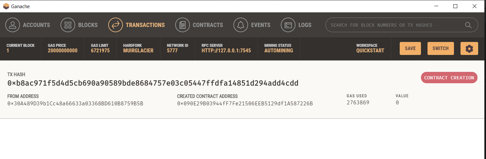
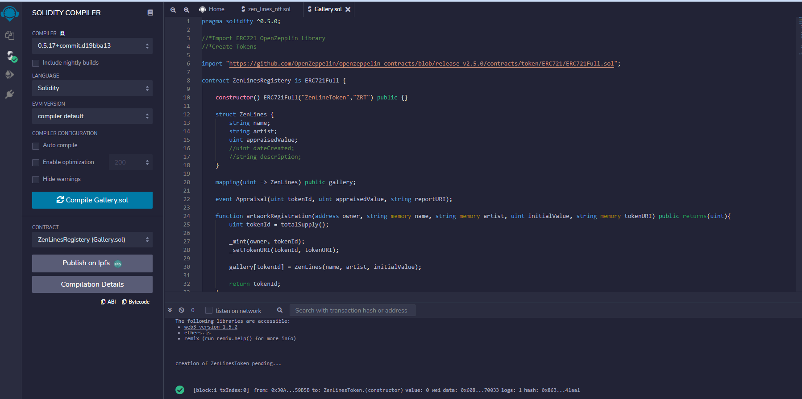

# Zen Line NFTs App
## Music and Image NFT
### NFT Solidity Contract By Zack Schmidt
### Gallery Solidity Contract, Music and Drawing By Cole Mills
### Auction Contract by Kailen Nelson
### Streamlit App integration by Franklin Vaca 
#

## **App creation:**

Two apps were created for this project:

- nft_app.py  - This app creates the TokenID of the music and image creation.

- app.py  - This app allows to register our musical piece and image to be stored in a Gallery. It also has the functionality to record and modify appraisals for the musc and image piece.

____________

# **Music and Image NFT**
## **TokenID creation app - nft_app.py:**

**Zen Lines NFT contract:**

The nft_app solidity contract was created by Zack and deployed using Ganache test network.

*Zen Lines Token contract reviewed and succesfully compiled* 

 

*Zen Lines Token contract deployment gas fees*

 

*App created using Streamlit* 

 

*TokenID created and receipt of the transaction sent to the blockchain.* 

 

*Gas fees incurred due to the TokenId creation.*

 

## **Gallery registration and appraisal app - app.py:**

**Gallery contract:**

The contract was created using Solidity, compiled and deployed using REMIX IDE, Metamask and Ganache.

*Gallery contract reviewed and succesfully compiled* 

 

*Gas Fees spent due to Contract Creation - Screenshot from Ganache transactions tab*

 

The App was created using streamlit and executed using GitBash

 

*Music registration in the Gallery*

 

*New Appraisal functionality of the App with receipt Hash information*

 

*Appraisal Report functionality of the App with blockchain hash information*

 

*Ganache transactions report indicating the gas fees associated to the execution of the different functionalities of the App.*

 

The contract were compiled and deployed without any issues as indicated in the screenshots. The gas fees from the transactions report from Ganache indicate that the App succesfully executed the contracts and added that information to the blockchain.

=======
# Zen Lines NFT Project

## For this project our goal was to create an NFT of Cole's zen lines artwork and music. The first step was to create the NFT contract and deploy it to a test network.

## We wrote and compiled the contract using OpenZepplin libraries for ERC721, Ownable, and Counters. ERC721 is the token standard for NFTs. The ownable access restrictor provides security to the contract by implementing standard ownership coding practices. Counters is a utility library for simplifying token ID generation, it uses less computational effort and therefore less gas. In order to use Counters.sol utility function for token IDs and the Ownable.sol access restrictor we had to use pragma solidity 0.8.0. Using pragma 0.8.0 required us to import the ERC721URIStorage extension in order to make use of the built in _setTokenURI function as it was moved from the ERC721.sol when pragma 0.8.0 was released.

## Compiled NFT contract:

## Once the contract was able to be compiled we deployed the contract to the Rinkeby test network. It can be found on Etherscan here: https://rinkeby.etherscan.io/tx/0xf13444561246587110c2b9ca48a9ff57a76dbfbb6da8640b461f90472e7be2f3

## Looking at the deployed contract in Remix IDE we see that we can call the "createZenLines" function, and input owner address and tokenURI to make an NFT with token ID 1 and a tokenURI that points to our metadata on IPFS https://user-images.githubusercontent.com/85138335/145272947-fd33a3bf-6dec-484d-901e-40adc40d3166.mp4 

## NFT creation example on Remix:

## Using this contract address and the ABI file in JSON format the next steps were to create metadata on IPFS for the NFT, create a UI using streamlit to create Zen Lines NFTs by generating token URIs attached to token IDs that point to our artwork stored in IPFS, and create an auction contract for selling the NFTs.

